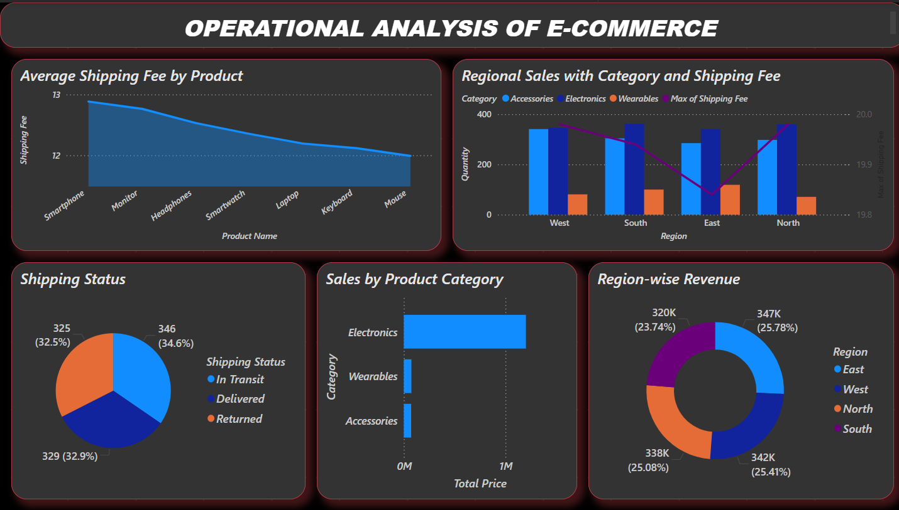
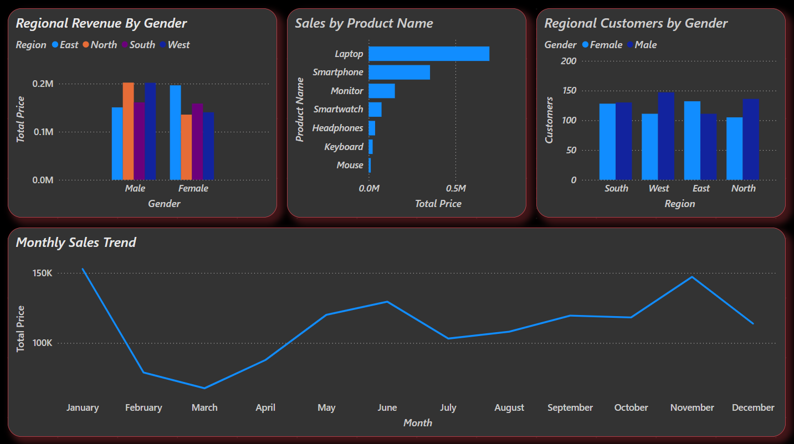
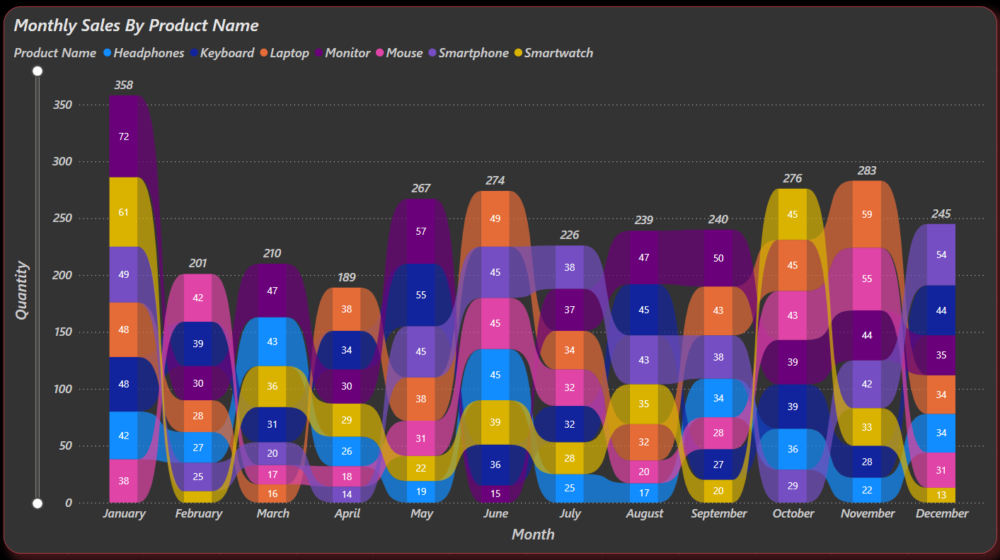

# 📊 Operational Analysis of E-Commerce - Power BI Dashboard

## 📁 Project Overview

This Power BI dashboard presents an operational analysis of an e-commerce platform, focusing on product performance, regional sales, shipping metrics, and customer demographics. It enables stakeholders to gain actionable insights and improve operational strategies.

---

## 🖼️ Dashboard Preview

### 🔼 Top Section

### 🔁 Middle Section

### 🔽 Bottom Section

---

## 📌 Key Features

### 🔄 Shipping Analysis
- **Average Shipping Fee by Product**
- **Shipping Status Breakdown**

### 📦 Product Performance
- **Sales by Product Category**
- **Sales by Individual Products**

### 🌍 Regional Insights
- **Regional Revenue and Customers (Gender-wise)**
- **Sales & Shipping Fee by Region and Category**

### 📈 Sales Trends
- **Monthly Sales Pattern**
- **Monthly Product Sales Dynamics**

---

## 🎨 Design Highlights

- Dark Mode Theme with rich color contrasts
- Rounded tiles and modern visual styling
- Organized visual hierarchy and user-friendly layout

---

## 🧰 Tools Used

- Power BI Desktop
- DAX for Calculated Columns
- Custom Visuals & Color Themes

---

## 📊 Insights Summary

- **Electronics** lead sales across all regions.
- **North & West** regions dominate in revenue generation.
- Gender-based regional analysis helps target specific demographics.
- Monthly trends show sales peaks during **January** and **November**.

---

## 🛠 Usage Instructions

1. Open the `.pbix` file in Power BI Desktop (file not included here).
2. Use slicers and filters to explore dynamic insights.
3. Export visuals or integrate into reports and presentations.

---

## 📝 License

For educational and portfolio purposes only. Not intended for commercial redistribution.

